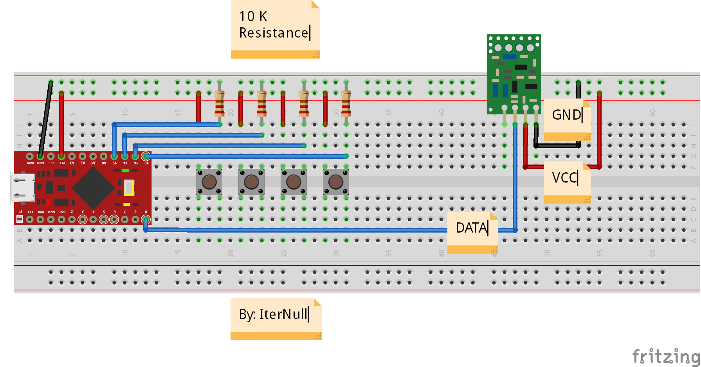
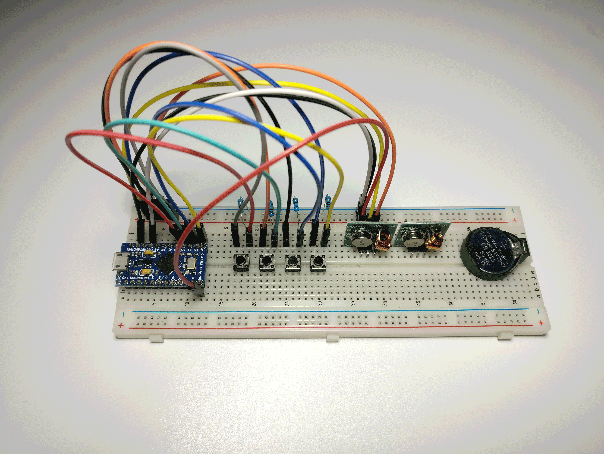

# bruteforce3-8remote

Brute Force Attack `3 ^ 8` Remote Control

# 简介 (Introduction)

这是一个使用 Arduino 硬件来对 3 态 8 位遥控器进行信号暴力穷举攻击的项目。

详细文章: [分析无线遥控器信号并制作 Hack 硬件进行攻击 | IterNull Blog](https://blog.iternull.com/posts/2017/02/04/Use-Arduino-brute-force-to-attack-remote-control.html)

# 安裝 (Installation)

使用 [Arduino IDE](https://www.arduino.cc/en/Main/Software) 打开文件 `examples/BruteForceAttack_4-8Remote/BruteForceAttack_4-8Remote.ino` 编译&上传到 Arduino 上。

代码里定义的针脚目前只适用于 Arduino Pro Micro ，其他版本的 Arduino 需自行修改针脚定义。

# 电路 (Circuit)

